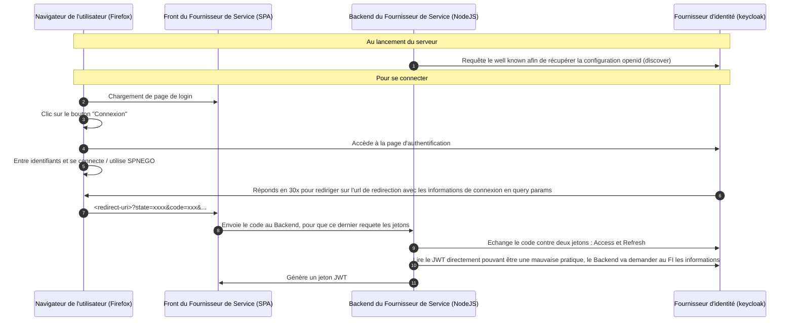

# Intégration mindef connect

Attention : La documentation ici présente est le fruit de rétro-ingénierie, en l'absence de documentation officielle en accès libre.

## Implémentation

L'implémentation sur stargate du protocole openid est partielle, on se contente de récupérer un jeton, d'introspecter deans pour récupérer l'email, afin de générer un jeton JWT stargate

## Configuration Keycloak

Pour pouvoir utiliser keycloak pour tester l'implémentation, il faut :

1. Créer un _realm_
2. Créer un _client_
    1. Passer ce _client_ en type "confidentiel"
    2. Définir des Redirect URI autorisées
3. Créer un _utilisateur_
    1. Définir un mot de passe sur cet _utilisateur_
4. Configurer les variables du backend avec :
    1. L'URL du _realm_
    2. L'ID du _client_
    3. Le secret du _client_
    
Plus de détails sur la méthode de configuration dans [la documentation Igloo](https://fabnum-minarm.gitlab.io/igloo/docs/third-party/mindef-connect.html).